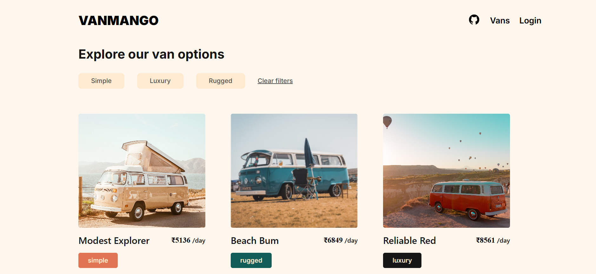

# VANMANGO

🚀 A **Van Management System** built using **Golang** with **PostgreSQL**, enabling advanced CRUD operations following standard REST API practices.

## [Visit Site](https://vanmango.vercel.app/)

## ✨Features

- 🔗 **Dependency Injection** for modularity
- 🔒 **JWT Authentication** for security
- ⌛ **API Versioning** for backward compatibility
- 🛠 Robust **error handling** for debugging
- 💾 **Persistant storage** using PostgreSQL
- 🤝 **API creation and consumption** using Golang

## 📌 Tech Stack

- 🖥️ **Frontend:** HTML, CSS, Golang
- 🌐 **Backend:** Golang
- 💾 **Database:** PostgreSQL
- 🚀 **Deployment:** Github (Code Repository), Frontend (Vercel), Server (Vercel), Neon (Database)
